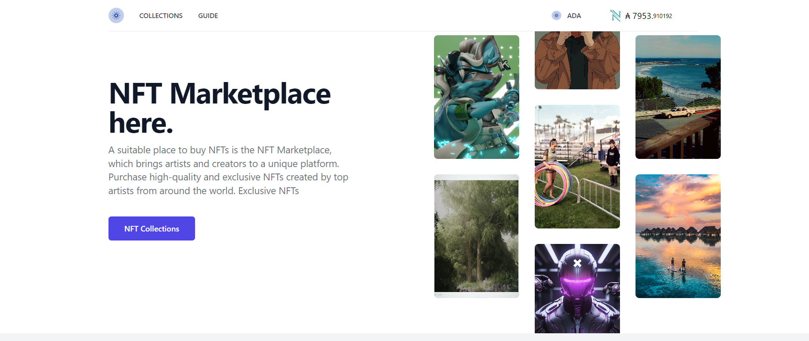
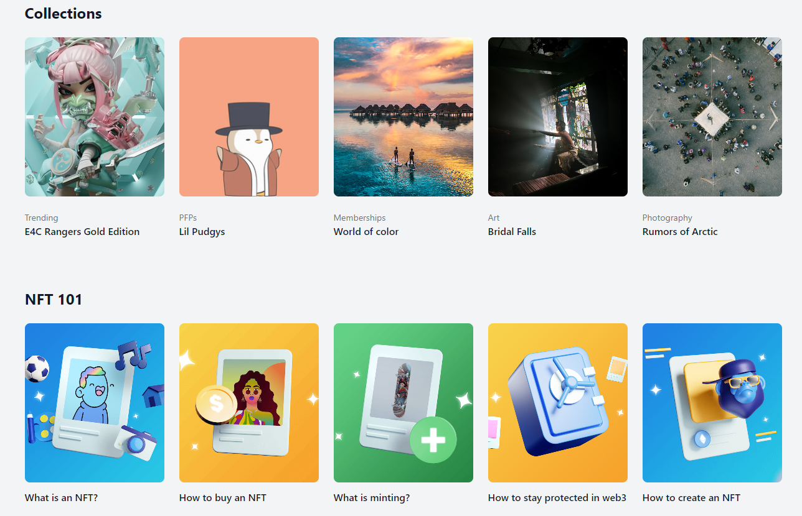
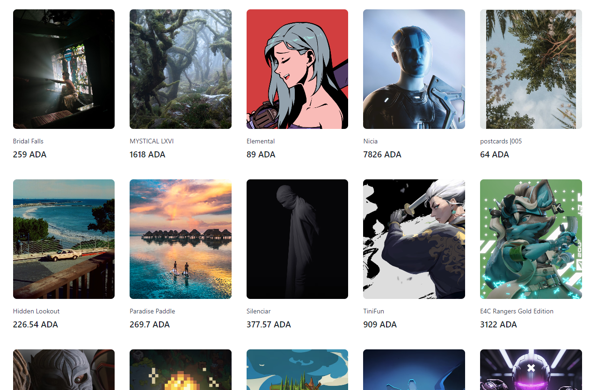
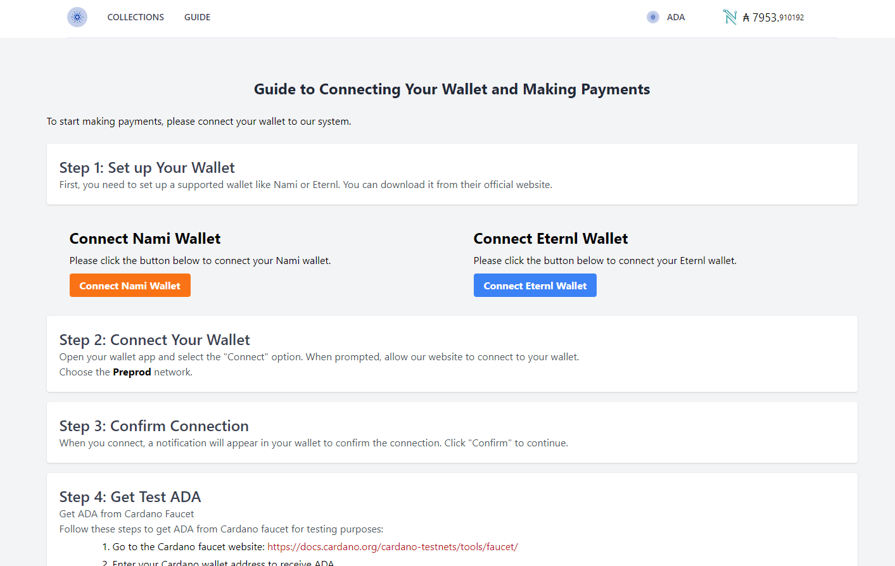
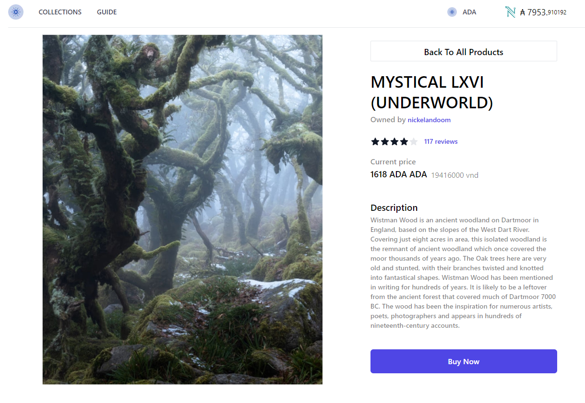
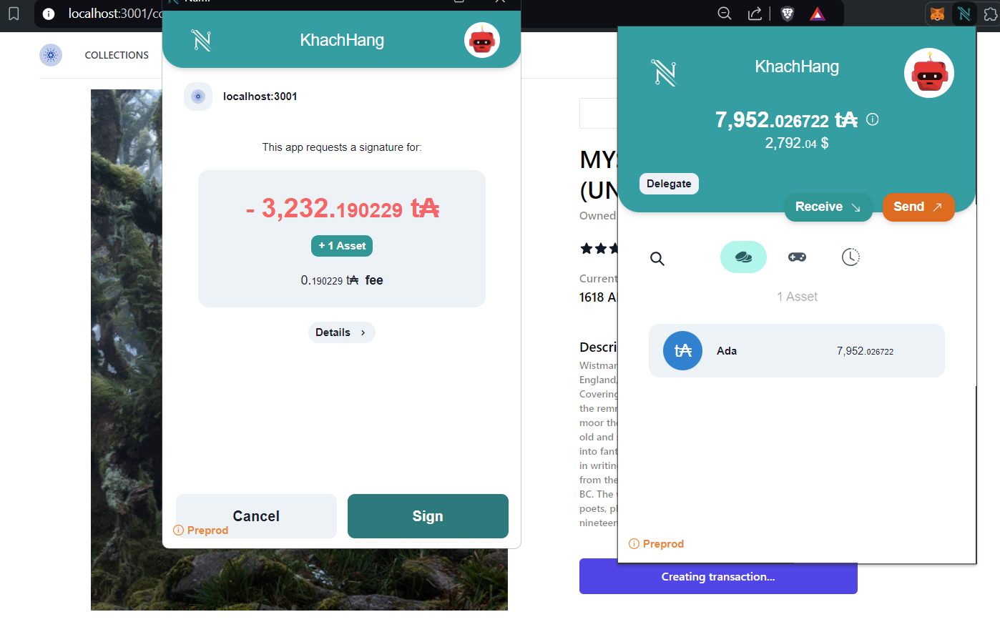

    <h1>NFT Market Gateway using Cardano Blockchain</h1>

*Due to @meshsdk version conflict, it cannot be deployed*

## Overview
NFT Market Gateway is a web-based platform that allows users to purchase NFTs provided by the admin. The platform utilizes the Cardano blockchain for secure and efficient transactions. Users can easily connect their Cardano wallets to buy NFTs listed on the marketplace.

## Key Features
- **Buy NFTs:** Browse and purchase NFTs listed by the admin using Cardano cryptocurrency.
- **Secure Transactions:** Payments are processed securely through the Cardano blockchain.
- **Wallet Integration:** Users can connect their Cardano wallets for seamless transactions.
## Technologies Used
- **Frontend:** Next.js, TypeScript
- **Blockchain:** Cardano
- **SDK:** Mesh SDK for Cardano integration

## Getting Started
**Clone the repository:**
- git clone + link github

**Install dependencies:**
- cd nftmarket
- npm install

**Run the application:**
- npm run dev

**Some pictures of the project**

    
    
    
    
    
    

## Contributing
We welcome contributions from the community. Please follow our contribution guidelines and code of conduct.
